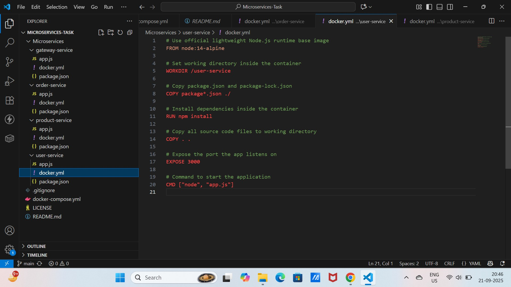

# Microservices-Task

## Overview
This document provides details on testing various services after running the `docker-compose` file. These services include User, Product, Order, and Gateway Services. Each service has its own endpoints for testing purposes.

---

1.Create a docker.yml file for each microservices and add contents inside it 
  
  ## for gateway-service-->
  
  

  ## for order-service-->
  
  

  ## for product-service-->

  

  ## for user-service-->

  


2.Create a docker-compose.yml file to Orchestrate All Services

 --Docker Compose helps run and manage multiple containers together. It defines services, networks, and port mappings in one file to start all microservices with a single command.


-- Defines all 4 microservices as separate containers.
-- Maps their respective ports for local access (Service port:Container port).
-- Assigns all services to a shared custom Docker bridge network for easy inter-service DNS resolution (using service names).

3.Build and Run the Microservices Locally with Docker Compose

--Running docker-compose up automates building images and starting containers.

-- In your project root (where docker-compose.yml exists), run:
     -->docker-compose up --build

--build ensures fresh images are rebuilt if Dockerfiles or source code changed.
--The services log output will be shown; check for errors.
--Use browser or curl to test each service endpoint.


4.Test Your Microservices Endpoints

  -->Ensuring each microservice is running correctly and responding to API requests.

  --> services and endpoints screenshots are attached

   
   
  

---

## Basic Troubleshooting Tips

1. check all ports are specified correctly to the respective services

2. check the app.js files also for the specified ports, it should be checked that port number
   mentioned in the app.js file should match the docker.yml file too.

3. The build context path must match your actual directory structure in docker-compose.yml file
    ** double check the directory name ** 
 
---

## Services and Endpoints

### **User Service**
- **Base URL:** `http://localhost:3000`
- **Endpoints:**
  - **List Users:**  
    ```
    curl http://localhost:3000/users
    ```
    Or open in your browser: [http://localhost:3000/users](http://localhost:3000/users)

---

### **Product Service**
- **Base URL:** `http://localhost:3001`
- **Endpoints:**
  - **List Products:**  
    ```
    curl http://localhost:3001/products
    ```
    Or open in your browser: [http://localhost:3001/products](http://localhost:3001/products)

---

### **Order Service**
- **Base URL:** `http://localhost:3002`
- **Endpoints:**
  - **List Orders:**  
    ```
    curl http://localhost:3002/orders
    ```
    Or open in your browser: [http://localhost:3002/orders](http://localhost:3002/orders)

---

### **Gateway Service**
- **Base URL:** `http://localhost:3003/api`
- **Endpoints:**
  - **Users:**  
    ```
    curl http://localhost:3003/api/users
    ```
  - **Products:**  
    ```
    curl http://localhost:3003/api/products
    ```
  - **Orders:**  
    ```
    curl http://localhost:3003/api/orders
    ```

---

## Instructions
1. Start all services using the `docker-compose` file:
   ```
   docker-compose up
   ```
2. Once the services are running, use the above endpoints to verify the functionality.

Happy testing!
