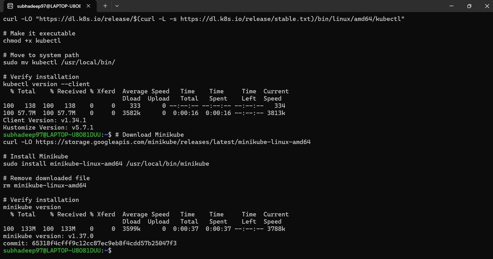
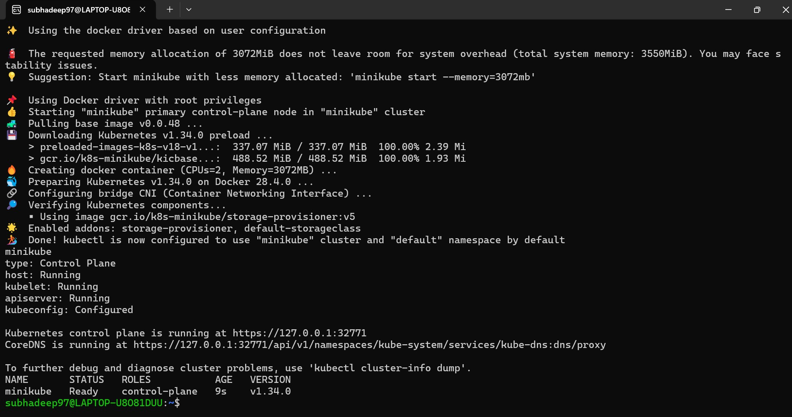

# Microservices Kubernetes Deployment

## Prerequisites
- Docker installed and running
- Minikube installed
- kubectl installed

## Project Structure

k8s-manifests/
├── deployments/
│ ├── user-service.yaml
│ ├── product-service.yaml
│ ├── order-service.yaml
│ └── gateway-service.yaml
├── services/
│ ├── user-service.yaml
│ ├── product-service.yaml
│ ├── order-service.yaml
│ └── gateway-service.yaml
├── ingress/
│ └── ingress.yaml
├── screenshots/
└── README.md

## Setup Instructions

### 1. Start Minikube

minikube start --driver=docker --memory=3072 --cpus=2
minikube status

### 2. Deploy All Services

--Navigate to k8s-manifests directory
cd k8s-manifests

--Deploy all deployments
kubectl apply -f deployments/

--Deploy all services
kubectl apply -f services/

### 3. Verify Deployment

--Check all pods are running (should show 8 pods - 2 replicas each)
kubectl get pods -o wide

--Check all services
kubectl get services

--Check deployments
kubectl get deployments

### 4. Test Inter-Service Communication

#### Method 1: Using kubectl exec

--Get gateway pod name
kubectl get pods | grep gateway

--Execute into gateway pod
kubectl exec -it <gateway-pod-name> -- sh

--Inside the pod, test other services
curl http://user-service:3000/health
curl http://product-service:3001/health
curl http://order-service:3002/health
exit

#### Method 2: Port Forwarding

--Forward gateway service to localhost
kubectl port-forward service/gateway-service 8080:3003

--In another terminal, test
curl http://localhost:8080/
curl http://localhost:8080/api/users
curl http://localhost:8080/api/products
curl http://localhost:8080/api/orders

#### Method 3: Using Minikube Service

--Get the URL
minikube service gateway-service --url

--Use the URL to test (in browser or curl)
curl <minikube-url>/api/users

### 5. View Logs

--View logs of specific service
kubectl logs -l app=user-service --tail=50
kubectl logs -l app=gateway-service --tail=50

--Follow logs in real-time
kubectl logs -f deployment/gateway-service

### 6. Bonus: Ingress Setup (Optional)

--Enable ingress addon
minikube addons enable ingress

--Wait for ingress controller to be ready (takes 1-2 minutes)
kubectl get pods -n ingress-nginx

--Apply ingress configuration
kubectl apply -f ingress/ingress.yaml

--Get Minikube IP
minikube ip

--Add to /etc/hosts (replace <MINIKUBE-IP> with actual IP)
echo "<MINIKUBE-IP> microservices.local" | sudo tee -a /etc/hosts

--Test ingress
curl http://microservices.local/api/users
curl http://microservices.local/api/products
curl http://microservices.local/api/orders
curl http://microservices.local/

## Architecture Overview

### Services
- **User Service** (Port 3000): Manages user data
- **Product Service** (Port 3001): Handles product catalog
- **Order Service** (Port 3002): Processes orders
- **Gateway Service** (Port 3003): API Gateway for routing

### Service Communication Flow

External Request → Gateway (NodePort 30003)
↓
┌─────────────┼─────────────┐
↓ ↓ ↓
User Service Product Service Order Service
(ClusterIP) (ClusterIP) (ClusterIP)

## Troubleshooting

### Pods Not Starting

--Check pod status and events
kubectl describe pod <pod-name>

--Check logs
kubectl logs <pod-name>

--Check if all pods are running
kubectl get pods --all-namespaces

### Image Pull Errors
If you see `ImagePullBackOff`:

--Check if images exist
kubectl describe pod <pod-name> | grep -i image

--You may need to build and push images first
--Or update the image names in deployment YAML files

### Service Connection Issues

--Verify service endpoints exist
kubectl get endpoints

--Check service configuration
kubectl describe service <service-name>

--Test DNS resolution from within a pod
kubectl exec -it <pod-name> -- nslookup user-service

### Minikube Issues

--Restart Minikube
minikube stop
minikube start

--Check Docker is running
sudo service docker status
sudo service docker start

--Delete and recreate cluster
minikube delete
minikube start --driver=docker --memory=3072 --cpus=2

## Cleanup

--Delete all resources
kubectl delete -f deployments/
kubectl delete -f services/
kubectl delete -f ingress/

--Stop Minikube
minikube stop

--Delete Minikube cluster (if needed)
minikube delete

## Testing Commands Summary

--Quick health check
kubectl get pods
kubectl get services
kubectl get deployments

--Test gateway service
minikube service gateway-service --url

--Port forward for testing
kubectl port-forward service/gateway-service 8080:3003

--View all logs
kubectl logs -l tier=backend --all-containers=true --tail=100

